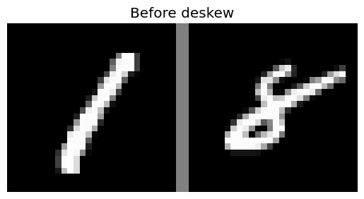
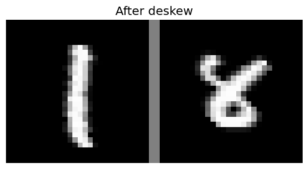

# MNIST Classification using Softmax Regression and Neural Networks

## Overview
This is a part of the **Introduction to Machine Learning** course at **University of Science, VNU-HCM (2023-2024)**. The goal is to classify handwritten digits from the MNIST dataset using different machine learning techniques, including **Softmax Regression**, **Neural Networks**, and various enhancements.

## Task Definition
Given a dataset of handwritten digits, the objective is to develop a machine learning model that can accurately classify an image into one of ten classes (0-9). Specifically, we are given a set of training samples:

$$\{(\mathbf{x}^{(1)}, y^{(1)}), ..., (\mathbf{x}^{(N_{train})}, y^{(N_{train})})\}$$

where:
- $\mathbf{x}^{(n)} \in \mathbb{R}^{784}$ represents the pixel values of a 28x28 grayscale image, flattened into a 784-dimensional vector.
- $y^{(n)} \in \{0, 1, ..., 9\}$ is the corresponding digit label.

The task is to learn a function $f: \mathbb{R}^{784} \to \{0, 1, ..., 9\}$ that can predict the correct digit for a given unseen sample.

## Dataset: MNIST
The **MNIST dataset** consists of **28x28 grayscale images** of handwritten digits (0-9). Each image is represented as as **784-dimentional vector** (flattened pixel values). The goal is to build models that can classify these images correctly.


## Implemented Techniques
### 1. Softmax Regression
- Softmax regression is a **generalized logistic regression** for multi-class classification.
- Given an input vector $x$, we compute the probability of each class $y$ using the softmax function:
  
  $$P(y = k | x) = \frac{e^{w_k \cdot x}}{\sum_{j=0}^{9} e^{w_j \cdot x}}$$
- The model is trained using **cross-entropy loss** and optimized with **gradient descent**.

### 2. Feature Engineering: Adding Intensity and Symmetry
- **Intensity:** The average pixel value of the image.
- **Symmetry:** The difference between the left and right halves of the image.
- These additional features improve classification performance by providing more meaningful representations of digits.

### 3. Stochastic Gradient Descent (SGD)
- Instead of using full-batch gradient descent, we implemented **Stochastic Gradient Descent (SGD)**.
- SGD updates the model parameters using small batches, making training **faster and scalable**.

### 4. Image Transformation: Deslanting digit image
- Many handwritten digits are slightly tilted, affecting classification accuracy.
- We implemented an image transformation method to **correct the tilt** by aligning the principal axis of the digit.




### 5. Neural Network Implementation
- Implemented a simple **Multi-Layer Perceptron (MLP)** with one hidden layer.
- The network consists of:
  - **Input layer:** 784 neurons (one per pixel)
  - **Hidden layer:** Sigmoid activation function
  - **Output layer:** Softmax activation for classification
- Trained using **backpropagation** and **SGD**.

### 6. $L^2$ Regularization (Weight Decay)
- To prevent overfitting, **L2 regularization** is applied:
  $$J_{reg}(\mathbf{W}; \mathbf{X}, \mathbf{y}) = J(\mathbf{W};\mathbf{X}, \mathbf{y}) + \alpha\Omega(\mathbf{W})$$

- With $\epsilon$ is learing rate, we update the parameters (in SGD) by:
$$\mathbf{W} \leftarrow \mathbf{W} - \frac{\epsilon}{B}\sum_{𝑛=(𝑏−1)𝐵+1}^{bB}(\alpha \mathbf{W} + \nabla_{\mathbf{W}}J(\mathbf{W};\mathbf{X}^{(n)}, \mathbf{y}^{(n)}))$$
- Helps improve generalization by discouraging large weights.

## Results and Observations
- Softmax Regression performs well but struggles with ambiguous digits.

- Feature engineering (intensity & symmetry) provides a small boost in accuracy.

- Deslanting digit image significantly improves classification accuracy by aligning digits properly, reducing misclassification caused by variations in writing style.

- Neural networks outperform softmax regression, especially when trained with $L^2$ regularization.

## How to run 
### Prerequisites

- Python 3.x
- NumPy, Matplotlib, Scikit-learn

### Clone the repository

```bash
git clone https://github.com/Gabien21/Introduction-to-Machine-Learning.git
```
## Conclusion

This project demonstrates different approaches to digit classification, from basic linear classifiers (**Softmax Regression**) to deep learning models (**Neural Networks**). The improvements, such as **SGD**, **deslanting digit image**, and **$L^2$ regularization**, significantly enhance accuracy.
